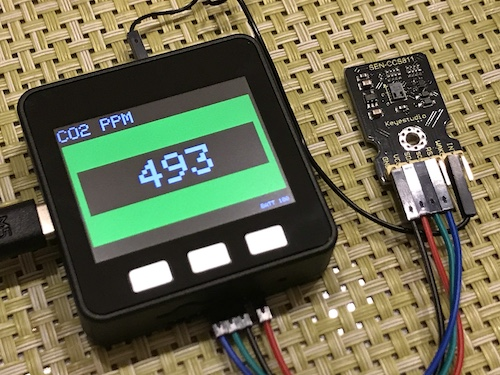

# M5Stack CO2 Monitor

## Requirement

### Hardware

- [M5Stack Basic](https://m5stack.com)
- [keyestudio CCS811 Carbon Dioxide Air Quality Sensor](https://wiki.keyestudio.com/KS0457_keyestudio_CCS811_Carbon_Dioxide_Air_Quality_Sensor)

### Software

- [Arduino IDE](https://www.arduino.cc/en/software)
- [keyestduio CCS811 library](https://wiki.keyestudio.com/KS0457_keyestudio_CCS811_Carbon_Dioxide_Air_Quality_Sensor)

## Usage

- Button A/C ... LCD brightness
- Button B ... LCD rotation

## License

Creative Commons Zero v1.0 Universal

